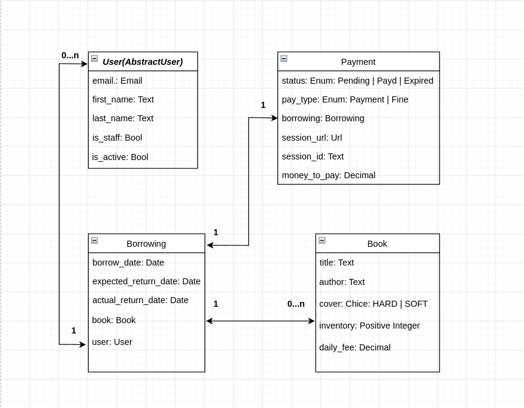

# library-service

## Overview

A Django-based web application for managing book borrowings
and inventory in a local library. Features include book CRUD
operations, user authentication, borrowing tracking, Stripe payments integration,
Telegram notifications, and comprehensive API documentation.

# Technologies Used

- Django: Backend framework for robust web applications.
- Django REST Framework: Toolkit for building Web APIs.
- PostgreSQL: Relational database management system.
- Redis: In-memory data structure store for caching and message brokering.
- Celery: Distributed task queue for background processing.

## Prerequisites

Before you can run this project, make sure you have the following installed:
- Python 3.8 or higher
- Django 3.2 or higher
- pip (Python package installer)
- PostgreSQL (or any other database you are using)

# Running the API with Docker
```shell
git clone `https://github.com/dissom/library-service.git`
cd library-service

create an .env file in the root directory of project:

    TELEGRAM_BOT_TOKEN=your-telegram-bot-token
    TELEGRAM_CHAT_ID=your-telegram-chat-id

    CELERY_BROKER_URL=redis://redis:6379/0
    CELERY_RESULT_BACKEND = redis://redis:6379/0

    STRIPE_PUBLIC_KEY=STRIPE_PUBLIC_KEY
    STRIPE_SECRET_KEY=STRIPE_SECRET_KEY
    STRIPE_SUCCESS_URL=STRIPE_SUCCESS_URL
    STRIPE_CANCEL_URL=STRIPE_CANCEL_URL

    POSTGRES_USER=POSTGRES_USER
    POSTGRES_PASSWORD=POSTGRES_PASSWORD
    POSTGRES_DB=POSTGRES_DB
    POSTGRES_HOST=POSTGRES_HOST
    POSTGRES_PORT=POSTGRES_PORT

    PGDATA=PGDATA

    DJANGO_SECRET_KEY=DJANGO_SECRET_KEY

docker-compose build
docker-compose up
- Create new admin user. `docker-compose exec app python manage.py createsuperuser`;

(The API will be available at `http://127.0.0.1:8000/`.)
```

## Demo

### Models Diagram



### Screenshots


